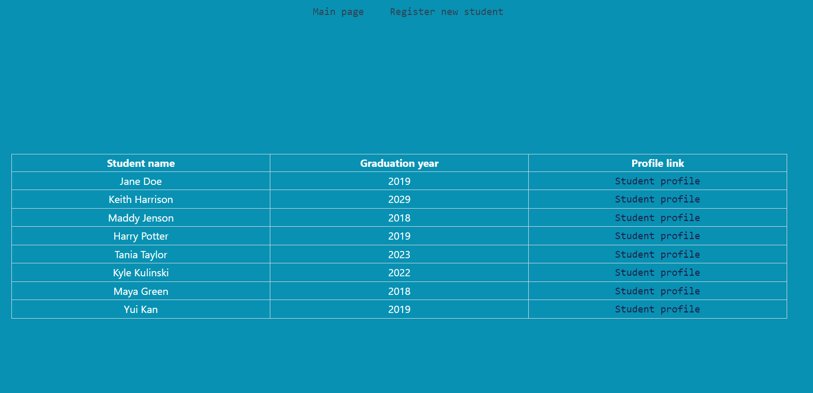
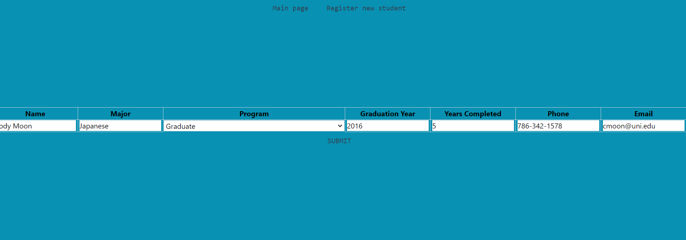
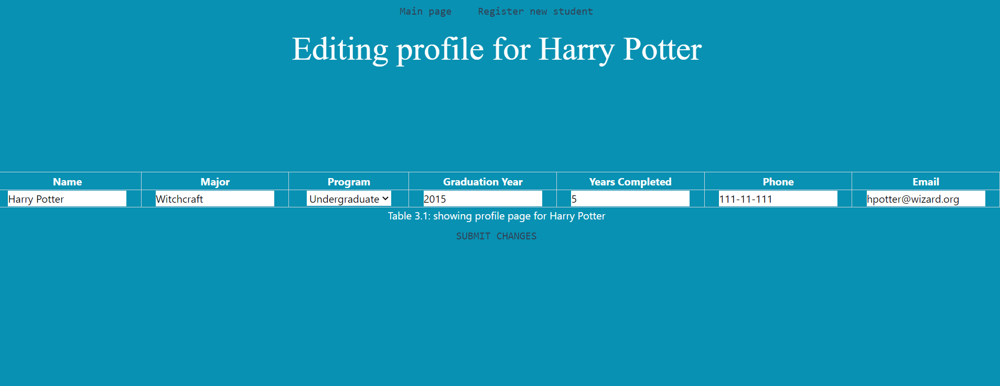
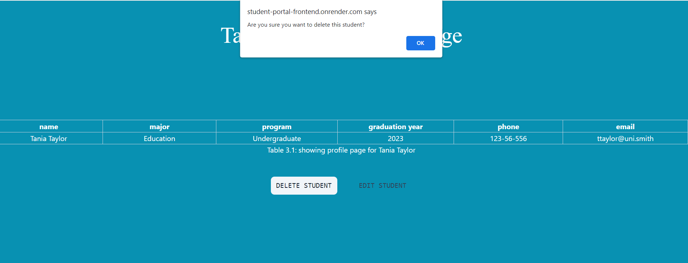

# Student Registry CRUD Application (Front-end)
## This is a simple CRUD application implementing a student registry where the admin can create, read, update, and delete students

* ### you can view the deployed website [here](https://student-portal-frontend.onrender.com)
* ### you can access the backend github [here](https://github.com/tamara-703/student-portal-BE)

## Technologies used
```
Javascript
React JS
Tailwind CSS
Render

```

### ###**NOTE**### 
The deployed link takes a while to load so if that happens, you can install the project on your local machine

## Local installation
1. Clone the repo to your local computer
2. After successfully cloning the project, run **npm install** to install all necessary json packages
3. run **npm start** to start the application on your local host!

# Screenshots

### homepage displays all current students in the database


### registering a new student allows the user to create a new student in the database


### editing an existing student's information will update the database


### deleting an existing student will remove them from the database


# Future Contributions
1. Add a login/signup feature where the user will be able to see his/her admin information once logged in
2. Add a profile page for the logged in user containing his/her personal information
3. Improve on the page's design
